# AI Modpack Builder

**Describe a Minecraft experience in plain English — the app builds it, tests it, repairs it, and lets you play it.**

> "Make me a Minecraft 1.20.1 medieval fantasy RPG modpack with around 120 mods, Create, magic, better villages, bosses, structures, realistic terrain, shaders, and good performance on 8 GB RAM."

The app searches real providers (Modrinth, plus CurseForge with a key), resolves dependencies and conflicts, downloads the mods, **launches the game to test the pack**, repairs crashes automatically, and exports a validated Modrinth `.mrpack`, CurseForge ZIP, and server pack. Nothing here is fake — every PASS in this project comes from a test that actually ran.

## Downloads & updates

- **Latest installer:** https://github.com/RBC-X/ai-modpack-builder/releases
- **Auto-update feed:** https://github.com/RBC-X/ai-modpack-builder/releases/latest/download/update.json

The installer is self-contained (Python and PyQt6 are bundled) and self-updates in place through the feed. Point **Settings → Updates → Update feed URL** at the feed above and updates install with SHA-256 verification and release notes.

## Quick start

**End users:** download the installer and run it — nothing else to install. Java is auto-detected and auto-installed on first launch. A CurseForge API key is optional (Settings → Sources).

**Developers:**

```bash
pyqt/.venv/Scripts/pip install -r pyqt/requirements.txt   # PyQt6 — the only dependency
pyqt/.venv/Scripts/python pyqt/main.py
```

The whole engine runs inside the app — no Node server, no localhost.

## Screenshots

Captured from the running app (offscreen render, real engine data, regenerated on every push):

| | | | |
|---|---|---|---|
| 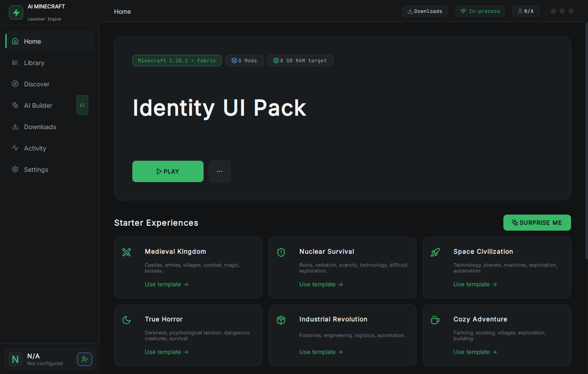 | 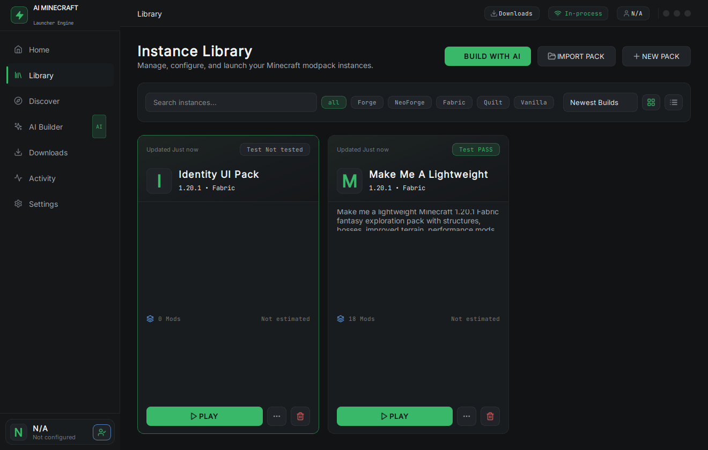 | 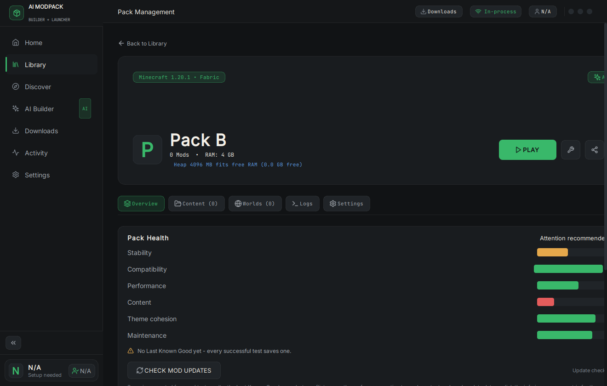 | 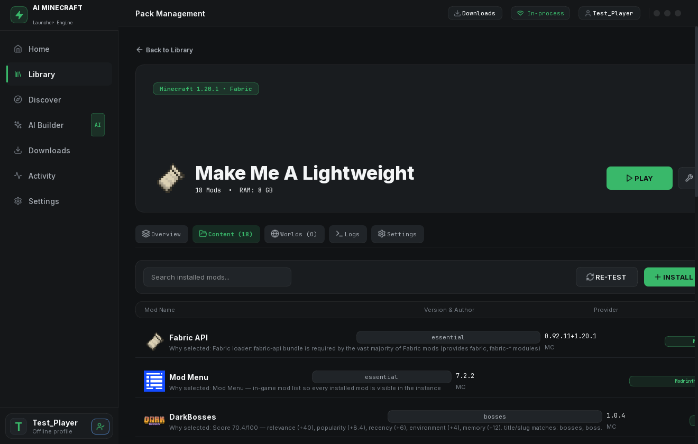 |
| 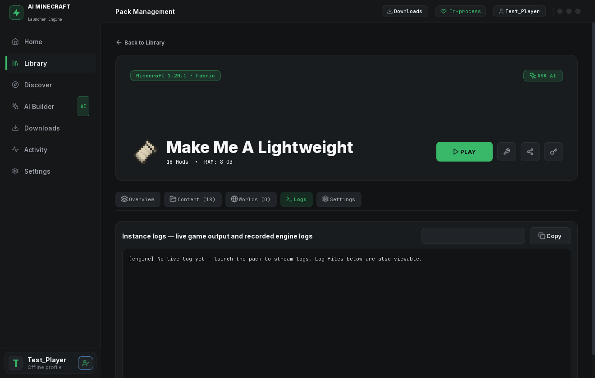 | 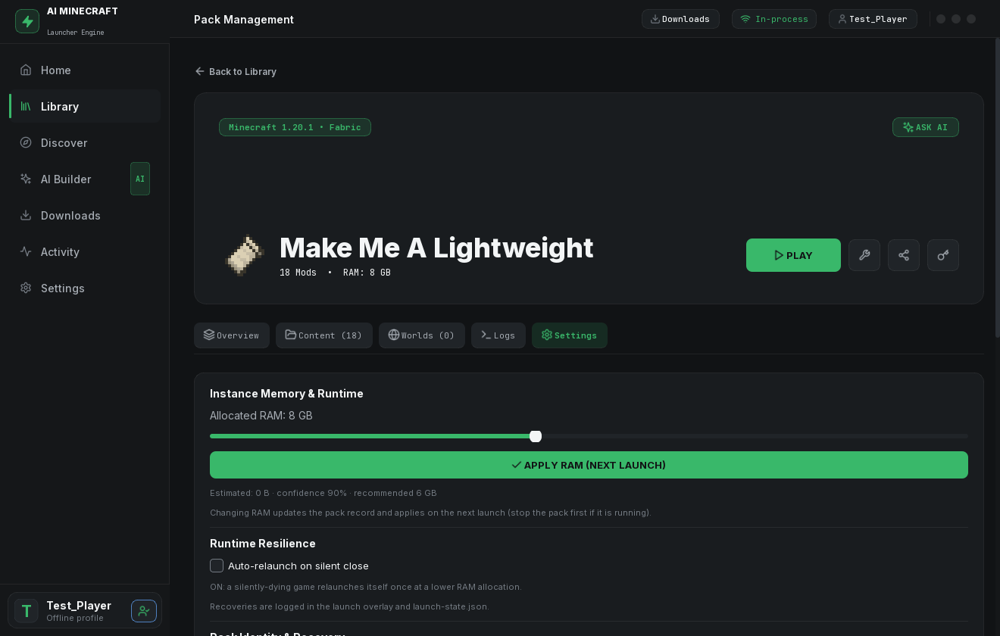 | 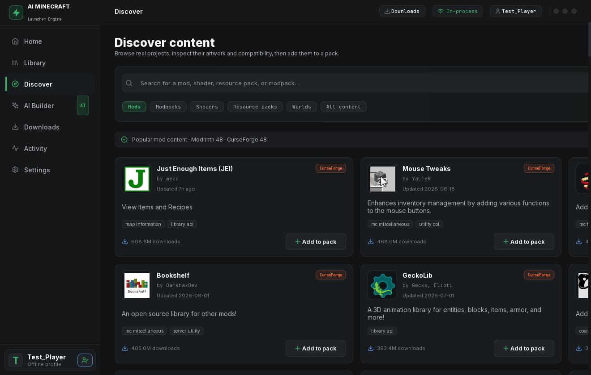 | 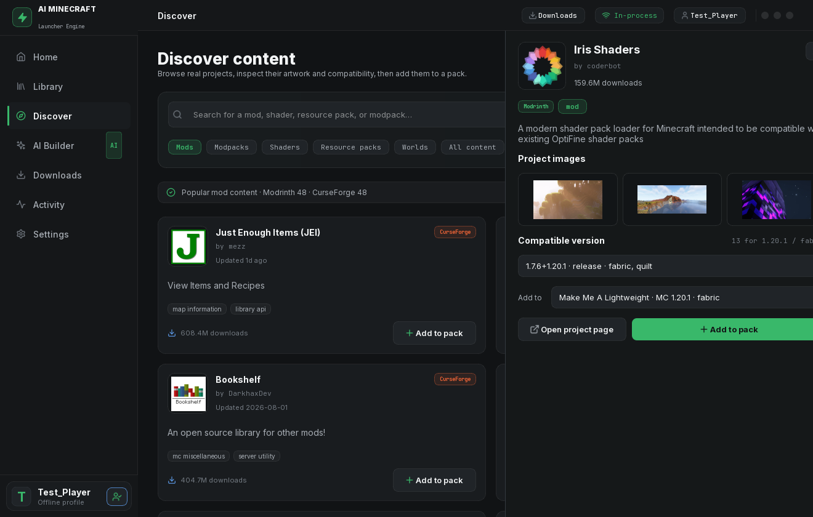 |
| 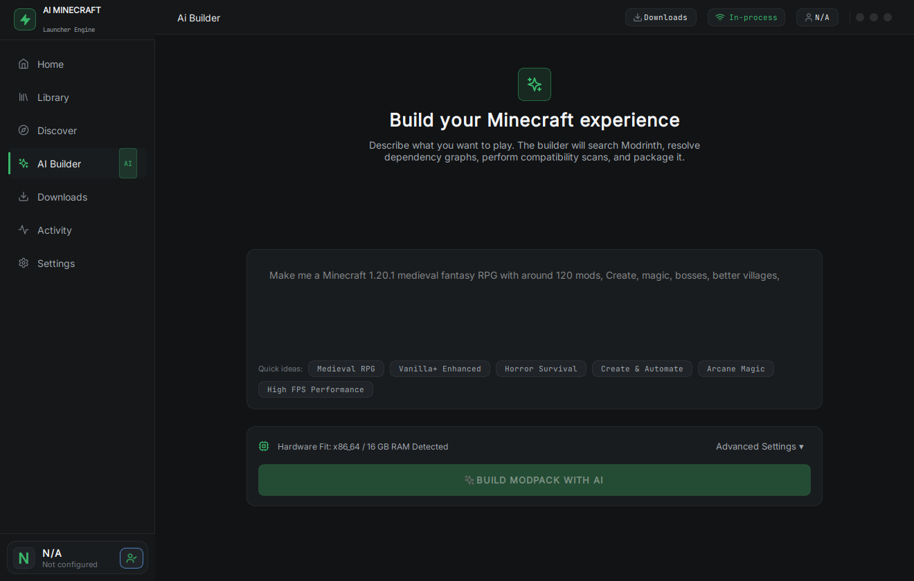 | 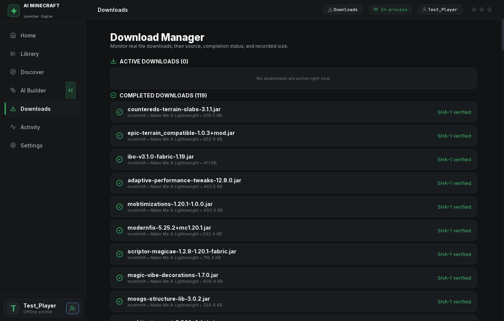 | 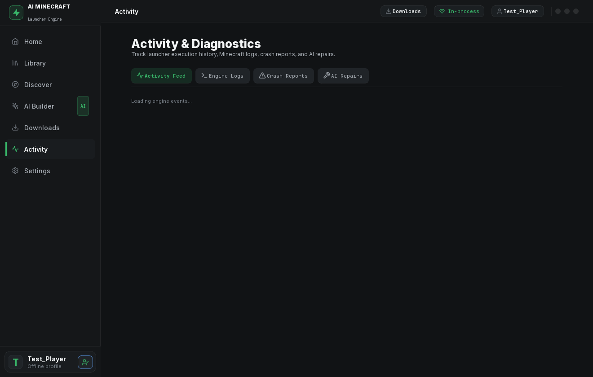 |  |
| 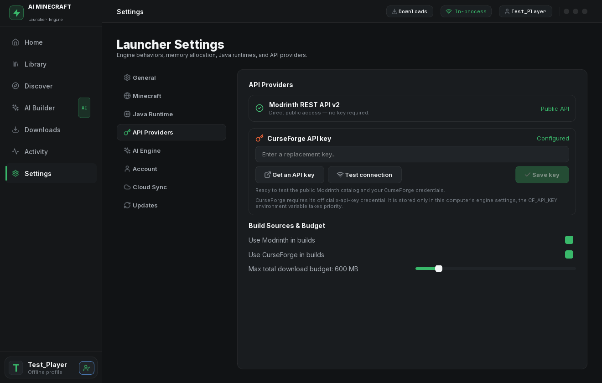 | 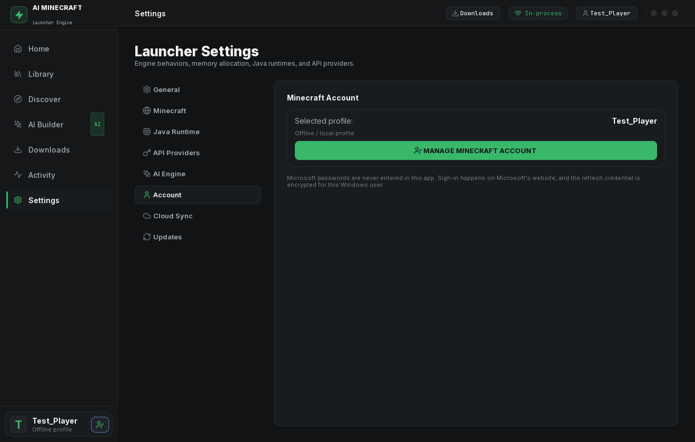 | 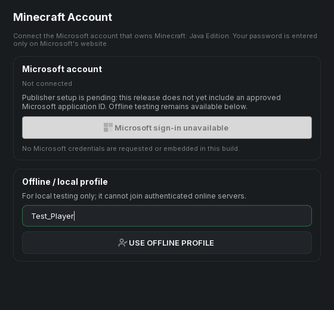 | 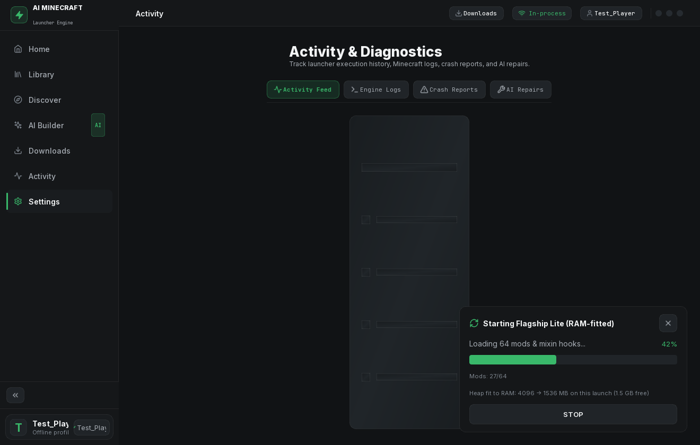 |

## What it does

- **AI Builder** — describe a pack and watch the real build stream (interpret → search → select → resolve → conflict → download → test → repair → export), or start from an editable starter-concept template or Surprise Me.
- **Launcher** — every tested pack is playable: Play / Stop / live status, plus per-pack RAM, shaders, and resource packs.
- **Repair** — crash logs are parsed for the real cause; missing dependencies are added and the pack is relaunched and re-tested automatically.
- **Pack health** — every pack gets an explainable score (stability, compatibility, performance, content, theme, maintenance) with the reasons behind each metric.
- **Exports** — validated Modrinth `.mrpack`, CurseForge ZIP, and server packs.
- **Self-update** — the installed app checks the feed and updates in place, with rollback to the previous version.

## Requirements

- **End users:** nothing — the installer is self-contained; Java is auto-handled.
- **From source (developers):** Python 3.11+, PyQt6 (`pyqt/requirements.txt`), and Java 17/21 (auto-detected, auto-installable).

## Tests & docs

- [ARCHITECTURE.md](ARCHITECTURE.md) — how the system is put together
- [PROJECT_STATUS.md](PROJECT_STATUS.md) — honest, evidence-based project state
- Run the suite: `pyqt/engine_self_test.py` (engine pipeline against live providers), `pyqt/smoke_test.py` (all UI views), `pyqt/inprocess_test.py` (the launcher runs entirely in-process)

## Layout

`pyqt/` — the desktop launcher (`main.py`), the Python engine (`engine/`), the UI views (`views/`), and the test scripts. `workspace/` holds builds, the shared Mojang install, and the compatibility database (git-ignored).
